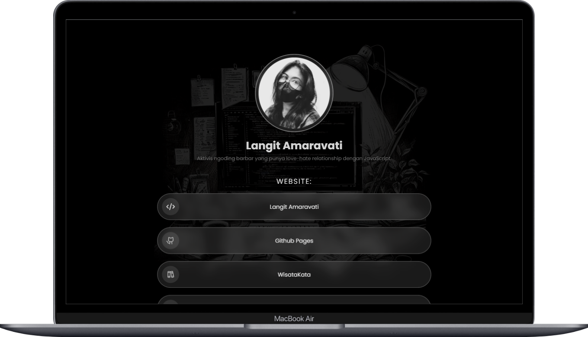
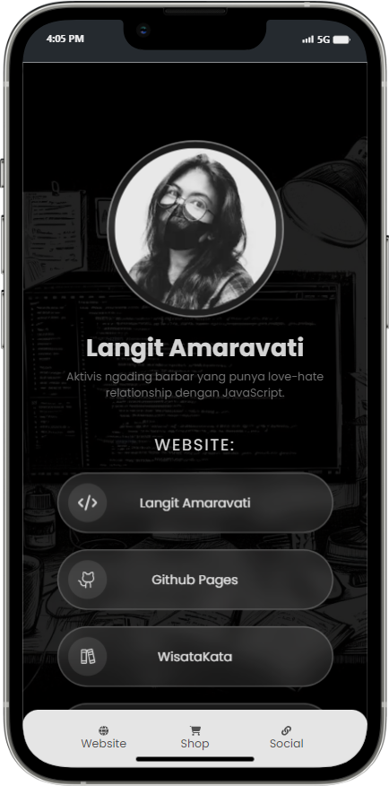

# Langit Link (Semacam Linktree)

Membuat sekumpulan link sendiri karena ... kenapa tidak? Terinspirasi dari Lee Robinson.





## Links

- [Repository](https://github.com/eLAmaravati/links)
- [Website](https://langit-link.vercel.app/)

## Tech Stacks

- React v.18
- Next.js v.14.0.4 (app router)
- Tailwind CSS v.3.4.0
- React Icons v.4.12.0

## Project Overview

Saat melihat video Lee Robinson (VP Vercel) membuat web applikasi "clone" Linktree, I was like "Hey, I can create something like that with 'vanilla' HTML + Tailwind + a little bit of JavaScript."

Karena tadinya saya pikir akan overkill kalau menggunakan Next.js. Tetapi karena saya pemalas, saya **tidak mau** menulis **kode HTML dan CSS yang sama berulang-ulang**. Maka, saya meniru Lee dan menggunakan Next.js agar bisa memanfaatkan komponennya React.

## Challenges & Approach

Tantangan paling besar adalah membuat navigasi dan mengubah style saat state active. Karena ini "SPA" dan link aktif menggunakan hash (#), kita tidak bisa menggunakan function `usePathname`. Maka saya menggunakan `useState` dan bantuan dari `clsx`.

```javascript
export default function BottomNavbar() {
  const [activeLink, setActiveLink] = useState('');

  const handleClick = (href) => {
    setActiveLink(href);
  };

  return (
    <nav className='rounded-t-[20px] fixed bottom-0 w-full bg-neutral-200 z-10 py-3'>
      <div className="container px-12 flex justify-between items-center gap-2">
        {links.map((link) => {
          const LinkIcon = link.icon;
          return (
            <Link
              key={link.name}
              href={link.href}
              onClick={() => handleClick(link.href)}
              className={clsx(
                'cursor-pointer text-xs flex flex-col justify-center text-neutral-600 items-center flex-1 rounded-full p-1 size-12 transition duration-300 hover:text-neutral-900 hover:bg-neutral-300',
                {
                  'bg-neutral-900 text-white hover:bg-neutral-900 hover:text-white': activeLink === link.href,
                },
              )}
            >
              <LinkIcon className="w-6" />
              <p className="text-sm">{link.name}</p>
            </Link>
          );
        })}
      </div>
    </nav>
  );
}
```

### React Icons

Dalam perjalanan mengerjakan project hore-hore ini, saya menemukan yang namanya React Icons, library yang hanya akan merender ikon **yang memang kita gunakan**. Tidak seperti kalau kita include icon library via CDN atau web font yang memasukkan 5 juta ikon padahal kita cuma pakai 5 biji. Juga tidak seperti memasukkan langsung file SVG yang ... to be honest, bukan best practice.

Tantangannya adalah apabila kita ingin memasukkan ikon dalam iterasi. Tetapi hal itu bisa diatasi dengan cara memasukkan ikon sebagai variabel terlebih dahulu kemudian menggunakannya sebagai komponen seperti biasa.